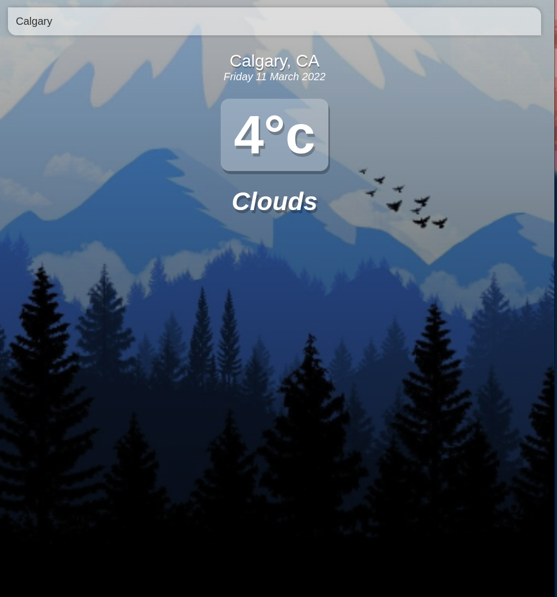
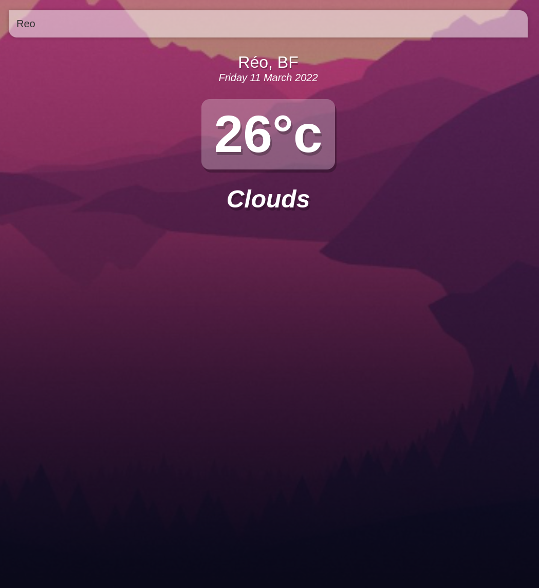

# weather

## Project setup
```
yarn install
```

### Compiles and hot-reloads for development
```
yarn serve
```

### Compiles and minifies for production
```
yarn build
```

### Lints and fixes files
```
yarn lint
```

### Customize configuration
See [Configuration Reference](https://cli.vuejs.org/config/).


### ScreenShots

When the weather is cold the background of the screen will change to a chilly looking state.



When the weather is hot the background of the screen will change to a warmer looking state.

